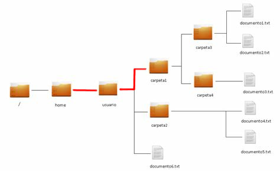

# Gestió de la informació

Ja hem vist com gestionar arxius i carpetes a través de la interfície gràfica (GUI). En aquesta secció estudiarem els principals comandaments relacionats amb la gestió de la informació utilitzant la línia de comandaments (CLI):
- Creació, modificació, eliminació... d'arxius i carpetes.
- Creació de taules de particions.
- Formatació de particions.
- Muntatge de particions. 

## Execucció de l'interpret d'ordres

Per a executar l'interpret d'ordres podeu utilitzar la drecera de teclat *Ctrl + Alt + T*. Altres opcions menys recomanades són anar a través del menú d'aplicacions o utilitzar les icones d'accés.

### Prompt

A l'accedir a la shell, vos apareixerà el prompt, indicant que està esperant instruccions:

`ferran@debian:~$`

**ferran** és l'usuari que està executant la shell.

**debian** és el nom de la màquina sobre la que està executant la shell. Ens podem connectar a altres màquines remotes a través de la shell.

**~** indica que en quin directori ens trobem actualment. El símbol *~* representa el home de l'usuari, és a dir, substituix */home/ferran*

**$** indica que l'usuari no té permisos d'administrador, en cas de tindre permissos d'administrador, apareixerà el símbol **#**.

## Estructura de l’arbre de directoris.
El sistema d'arxius de Linux té una estructura jeràrquica, on tots els directoris pengen d'un, anomenat arrel, que es representa pel caràcter "/".
Penjant d'ell podem trobar altres directoris, i així successivament.
El conjunt d'un directori de què pengen altres directoris amb fitxers i més subdirectoris es coneix com a arbre de subdirectoris.
Dels directoris més importants destaca el directori *home*, que conté els arxius personals dels usuaris de sistema.
Altres directoris són els següents:

* /bin → conté els programes que poden executar tots els usuaris de sistema. Són arxius binaris o executables.
* /boot → conté els fitxers de configuració d'arrencada de sistema.
  * /boot/grub → conté el carregador d'arrencada GRUB. 
* /dev → conté els arxius de l'maquinari de el sistema. 
* /etc → conté els fitxers de configuració de sistema.
* /home → és el directori que conté els directoris personals de tots els usuaris de sistema. A més, per a cada usuari, tindrà el directori:
  * /home/usuari/Escriptori → conté l'escriptori de l'usuari (en ocasions apareix com Desktop en lloc d'Escriptori).
* /lib → conté les biblioteques necessàries perquè s'executin els programes que tenim en /bin i /sbin.
* /media → conté les unitats físiques que tenim muntades o que es munten automàticament, com discs durs, unitats de DVD, pendrives ...
* /mnt → directori on es munten sistemes d'arxius de forma temporal, quan sigui necessari.
* /opt → aquí podem instal·lar aplicacions que no vénen en els repositoris i que per tant no s'instal·len automàticament.
* /proc → conté arxius que reben o envien informació a l'nucli. Els fitxers que conté realment resideixen en memòria. Aquests fitxers ens permeten obtenir informació sobre els processos en execució. Per exemple, el fitxer partitions conté informació de les particions del disc. El fitxer sistemes de fitxers conté els sistemes d'arxius de sistema.
* /root → directori personal de l'root o administrador de sistema.
* /sbin → conté programes que només pot executar el superusuari.
* /usr → conté els programes d'ús general per a tots els usuaris.
* /tmp → conté arxius temporals.
* /var → conté informació variable, registres, dades dels servidors, etc.
  * /var/log → conté els fitxers de registre (logs).  

## Gestió de fitxers i directoris.

## Rutes:

### Rutes relatives: 
Les rutes relatives indiquen el camí per trobar un element, però basant-nos en el directori des del qual s'executa l'ordre, o sigui, des del directori on ens trobem posicionats. Per saber si són correctes o no hem de saber sempre des d'on s'han utilitzat.
Vegem algun exemple:



Si em trobe en el directori `/home` i voldria mourem al directori `/home/usuari/carpeta1` hauria d'indicar el camí fins on vull anar partint des d'on em trobe. Vegem

```
cd usuari/carpeta1
```

### Directori pare
Anomenem directori pare, a directori que conté a aquell en el qual ens trobem.
És fonamental per a la construcció de rutes relatives saber que `..` representa el directori pare. Per tant si executo `cd ..` estic donant l'ordre de canviar des del directori actual al seu pare.

Si fem ls -la al directori actual ens monstra un directori . I un directori ..  el primer fa referència a directori on ens trobem i el segon respectivament fa referència a directori pare.
Per moure'ns cap enrere fent ús de rutes relatives podem indicar-li a l'ordre cd que es mogui  al seu directori pare (un nivell dins de la jerarquia cap enrere) o de diversos alhora depenent de cap a on vulguem moure'ns.
Si estem a la carpeta1 i volem pujar 3 nivells seria 

```
cd ../../..
```

### Rutes absolutes:
El sistema de fitxers és una estructura jeràrquica que en el cas de Linux té una arrel que s'indica quan es posa només el caràcter barra /. L'arrel conté els directoris principals de sistema que a la vegada tindran subdirectoris en el seu interior, aquesta estructura de directoris es correspon amb l'estàndard de jerarquies de directoris FHS. Quan jo vull indicar on es troba un element fent servir una ruta absoluta, hauré d’indicar-li tots els directoris pels quals cal passar començant des de l'arrel de sistema, SEMPRE.

Exemple: al cas anterior, tenint en compte la imatge per accedir a carpeta1
```
cd /home/usuario/carpeta1
```
Aquestes rutes solen ser bastant llargues, però com avantatge tenen que funcionen sempre, sense importar el lloc des del qual executi l'ordre. És molt recomanable utilitzar la facilitat que ofereix la shell de completar el nom d'un element de sistema de fitxers prement la tecla tabulador. Estalviarà molt de temps i possibles errors de mecanografia (tenint en compte que es discriminen majúscules i minúscules en els noms dels directoris), a aquesta acció la coneixem com autocompletat.

## Ordres bàsiques:

### ls
La comanda ls permet llistar el contingut d'un directori. 
Sintaxi: 
```
  ls [opcions] [directori | fitxer]
```

Algunes opcions:
* -l: mostra la sortida en format llarg.
* -R: llista recursivament un directori.
* -a: llista més els fitxers ocults.
  > Recordeu que els arxius ocults comencen per punt.
* -h: mostra la mida dels fitxers en forma més llegible (Ex .: 16M, 4k, etc.) -i: mostra l'identificador de l'i-node associat a cada element.

#### *Globbing*: *wildcards* (comodins) i opcions

El *Globbing* ens permet trobar arxius dels quals no coneixem el nom exacte però tenim una idea quins elements de text el componen. Per això utilitzem els anomenats *wildcards* (comodins) de manera que aquests serveixen per trobar patrons durant les búsquedes.

Hem vist anteriorment que l'ordre ls llista fitxers i directoris. Suposem que volem llistar només aquells fitxers que tinguin l'extensió “.doc”. Amb la següent ordre ho aconseguirem:

```bash
$ ls *.doc
```

> En aquest exemple hem indicat que lliste qualsevol arxiu amb l'extensió “.doc”. L'asterisc fa la funció de comodí (qualsevol cadena de caràcters).

Els caràcters comodí poden apareixer al principi, al final o entre mig dels patrons, inclús poden aparéixer diverses vegades.

Així com el caràcter asterisc substitueix qualsevol cadena de text, de longitud indeterminada, el caràcter ? substitueix un únic caràcter, de longitud 1. En aquest cas també poden aparéixer diverses vegades i en diverses posicions.

Per exemple: 

```bash
$ ls arxiu-?.jpg
```

Llistarà arxius com arxiu-1.jpg, arxiu-a.jpg... Però no arxius com arxiu-12.jpg.

Tenim la possibilitat de passar-li diferents opcions per fer globbing utilitzant els caràcters `{}`. Per exemple, si volem llistar els directoris /dev i /home a la vegada, podem fer `ls /{dev,home}`. També podem utilitzar els mateixos caràcters per generar opcions numèriques de forma molt comprimida, per exemple `ls {1..9}` llistarà el contingut de les carpetes 1 a 9. Si no volem que genere d'un en un les llistes numèriques, li podem indicar un bot en un tercer paràmetre. `ls {1..10..2}` llistaria el contingut de les carpetes 1,3,5,7 i 9.

> El globbing es pot utilitzar en altres ordres també.

Exemples:

1. Des del teu directori personal, mostra en format llarg els fitxers tty0 a tty9 de directori /dev, utilitzant caràcters comodins.
2. Mostra ara els fitxers de directori /dev que comencin per tty, independentment del caràcters hagi després.
3. Mostra les entrades del teu directori personal, de manera que et mostri l'i-node de cadascuna i informació sobre el tipus de fitxer.
4. Mostra les entrades del teu directori personal, en format llarg.
5. Mostra-ara amb la mida dels fitxers en la unitat de mesura més gran que es pugui


### cd
La comanda cd s'utilitza per canviar el directori actual. 
Sintaxi: 
```
cd [directori]
```

exemples:
```
  $cd /tmp
  $cd   #canvia a el directori home 
  $cd ~ #canvia a el directori home 
```

### pwd

La comanda pwd indica el camí absolut de directori en el qual ens trobem actualment. exemple:

```
$pwd # ens torna alguna cosa com /home/ubuntu
```

Exemples:

1. Mostra la ruta absoluta de directori on estàs. Mou-te a directori arrel. Aneu ara a directori /etc/init.d Utilitza la comanda que et porti a directori d'on véns. Comprova on estas.
solució:

```
pwd
cd /
cd /etc/init.d 
cd ~
pwd
```


### mkdir
La comanda mkdir s'utilitza per crear directoris.

exemples:
```
$mkdir bin
$mkdir /bin
$mkdir -p docs/linuxdocs  HOWTO/pdf #es creen els directoris intermedis si cal
```

### mv
La comanda mv mou un fitxer cap a un altre, o diversos fitxers cap a un directori. Aquest permet al seu torn canviar el nom fitxers o directoris.
Sintaxi: 
```
mv [opcions] <orige> <destí>
mv [opcions] <fitxers> <directori>
```

Algunes opcions:

* -i: executa la comanda de forma interactiva, és a dir, pregunta davant de sobreescriure el destí si existís.
* -u: actualitza (upgrade) el destí amb el orige només si aquest és més recent.

exemples:
```
$mv mail.cf mail.cf.old #reanomeneu un fitxer
$mv -i *.txt /tmp #mou fitxers acabats en .txt a directori /tmp
$mv -u program.c src/ #actualitza el fitxer destí si és menys recent que el d’orige.
```

### cp
La comanda cp permet copiar un fitxer en un altre, o diversos fitxers en un directori. 

sintaxi:

```
cp [opcions] <font> <destí>
cp [opcions] <fitxers> <directori>
```

Algunes opcions:

* -R: còpia recursivament un directori.
* -i: utilitza una forma interactiva (pregunta abans de sobreescriure el destí). 
* -l: fa enllaços forts als fitxers fonts en lloc de copiar-los.

exemples:

```
$cp /etc/passwd. # Còpia un fitxer en el directori actual
$cp -i /usr/bin/* sh/tmp # còpia interactivament els fitxers acabats en sh en un directori anomenat /tmp
```

### rm
La comanda rm s'utilitza per esborrar (desenllaçar) fitxers Sintaxi: 

```
rm [opcions] <fitxers|directoris>
```

Algunes opcions:

* -r: esborra recursivament un directori.
* -f: esborra forçosament en cas que no es tingui permís d'escriptura en forma directa. 
* -i: executa la comanda de forma interactiva.

exemples:
```
$rm prova
$rm -i bin/*
$rm -rf /tmp
```

### file 
mostra el tipus de fitxer

### du (disk usage)
mostra l'espai que ocupa el fitxer o directori

opcions:

* -b → mostra la mida en bytes
* -h → mostra la mida en la unitat de mesura més gran, perquè s'entengui millor


### df (display free)
mostra l'espai lliure en els dispositius d'emmagatzematge
opcions:

* -h → mostra la mida en la unitat de mesura més 
* -k → --blok-size = 1K
* -a → mostra tots, fins i tot els que tinguin mida 0

### cat (catenate) 
mostra el contingut dels fitxers que se li passin com arguments.
opcions:

* -n → enumera totes les línies.

### head
mostra les 10 primeres línies dels fitxers que s'indiquin
opcions:

* -n → mostra les n primeres línies en lloc de les 10 primeres. 

### tail
mostra les 10 últimes línies dels fitxers que se li indiquin
opcions:

* -n → mostra les n darreres línies
* -f → mostra les modificacions de el fitxer en temps real

### more
mostra el contingut dels fitxers però de forma paginada. A diferència de la comanda cat, quan mostri el contingut de l'arxiu, si aquest ocupa més d'una pantalla, es quedarà esperant que es premi una tecla. Si és la barra d'espai, s'avançarà una pàgina, i si és la tecla enter, s'avançarà una línia. Amb la tecla q finalitzarà l'execució.

### less
mostra el contingut dels fitxers de la mateixa manera que more, amb la diferència que podem moure'ns per ells utilitzant les tecles de cursor.

## Filtres i readreçaments:

### sort

La comanda sort ordena les línies d'un fitxer mostrant per la sortida estàndard. De no especificar-un fitxer pren l'entrada estàndard.
Sintaxi:
```
 sort [opcions] [fitxer]
```

Algunes opcions:

* -r: ordena a l'inrevés.
* -f: tracta les majúscules i minúscules per igual.
* -g: ordena de forma numèrica, de manera que no cal que els números es omplin amb zeros per l'esquerra.

Exemple: 

```
$sort -f /etc/passwd
```

### ln

crea un enllaç a el fitxer o directori que se li especifiqui. Si és a un directori, l'enllaç serà simbòlic.
opcions:

* -s → crea un enllaç simbòlic en comptes de dur
* -t → especifica el directori on es crearan els enllaços

### cut

mostra només certes línies dels fitxers que se li passin com a argument.
opcions:

* -b → mostra només els bytes que se li especifiquin
* -c → mostra només els caràcters que se li especifiquin
* -d → fa servir el caràcter que se li especifiqui com a delimitador en comptes del tabulador
* -f → mostra només els camps que se li indiquin a la llista. Pot ser un camp, una sèrie de camps separats per comes o un rang.
* -s → no mostra les línies que no continguin el delimitador --output-delimiter = cadena → fa servir la cadena com a delimitador de sortida en comptes del delimitador d'entrada.

### grep

mostra les línies d'un fitxer que coincideixen amb un patró especificat.
opcions:

* -r → -R → per buscar de forma recursiva dins dels fitxers d'un directori
* -n → mostra el nombre corresponent de la línia en què es troba el patró
* -i → no distingeix entre majúscules i minúscules
* -v → mostra les línies que no es corresponen amb el patró
* -w → el patró ha d'aparèixer com una paraula completa i no com una part d'una paraula
* -c → escriu el nombre de línies que satisfan la condició
* -l → s'escriuen els noms dels fitxers que contenen línies buscades

patró:

```
*text* → línies que continguin la cadena "text" 
^text → línies que comencin per "text" 
^[^text] → línies que no comencen per "text" 
*text → línies que acabin per "text"
```

### readreçaments

< → redirecciona l'entrada estàndard substituint-la per l'arxiu que s'indique.
\> →redirecciona la sortida d'un procés a el fitxer que se li indiqui, esborrant la informació que el fitxer contenia.

\>> →redirecciona la sortida d'un procés a el fitxer que se li indiqui, però afegint aquesta sortida a la fi de el fitxer, sense esborrar l'anterior.

2> →redirecciona la sortida d'errors d'un procés a el fitxer que se li indiqui, esborrant la informació que el fitxer contenia.

2>> →redirecciona la sortida d'errors d'un procés a el fitxer que se li indiqui, però afegint aquesta sortida a la fi de el fitxer, sense esborrar l'anterior.

### Filtres o canonades
Les canonades o filtres s'utilitzen en una línia d'ordres per a connectar la sortida estàndard d'una ordre amb l'entrada estàndard d'un altre. Per a això s'utilitza el caràcter |.

## Comprimir/descomprimir

### Comanda gzip:
Si el que necessites és comprimir només un arxiu, només cal escriure el seu nom després de la comanda gzip. Si no et trobes en el mateix directori on estan ubicats els arxius, hauràs d'escriure també la ruta. Una cosa semblant al que fem en el següent exemple:

```
gzip "/home/usuario/Imágenes/wallpaper/photo01.jpeg" (crearia un fitxer amb extensió .gz)
```

Per a descomprimir-lo utilitzariem l’ordre :
```
gunzip "/home/usuario/Imágenes/wallpaper/photo01.jpeg.gz"
```

Podem comprimir més d’un arxiu a la vegada i crearà 3 fitxers nous comprimits:
```
gzip arxiu1.txt arxiu2.txt arxiu3.txt 
```

### Comanda tar:
En realitat, l'ordre tar està pensat per crear un nou arxiu que actuï com a contenidor d'altres arxius, però no els comprimeix.
Així, per exemple, podem crear un arxiu que contingui en el seu interior totes les imatges en format jpeg d'un directori, escrivint la següent ordre:

```
 tar -vcf ~/Imatges/wallpaper/imagenes.tar  ~ /Imatges/wallpaper/*.jpeg
 ```

En el nostre exemple, hem utilitzat la mateixa ruta com a origen i com a destinació, perquè puguis veure a la finestra de l'explorador d'arxius del que està passant. No obstant això, tu pots fer servir les que prefereixis.En aquest cas, l'argument v ens permet obtenir detalls de l'funcionament de tar, l'argument c indica que volem crear un arxiu i l'argument f especifica el nom de l'arxiu contenidor (en aquest exemple, Imágenes.tar).
A continuació, només ens falta incloure els arxius que anem a emmagatzemar en el contenidor (en el nostre exemple, tots els que acabin en .jpeg).
Comprovar el contingut d'un arxiu contenidor
Un cop creat l'arxiu contenidor, podrem consultar el seu contingut canviant l'argument c per t. Així, per veure el contingut de l'arxiu anterior, escriurem el següent:
```
tar -vtf imagenes.tar
```
Hem dit a el principi que l'ordre tar, per si mateix, no comprimeix la informació que guarda dins de l'arxiu contenidor. No obstant això, podem utilitzar l'argument z perquè la sortida de l'ordre tar s'enviï a la comanda gzip obtenint així un arxiu comprimit.
Per comprovar-ho, tornem a la carpeta amb les imatges originals:
```
tar -czvf imagenes.tar.gz  *.jpeg
```

A més, fins i tot podem triar enviar-los a bzip2, un altre comanda de compressió que aplica algoritmes diferents a gzip. Per aconseguir-ho, només cal canviar l'argument z, que afegíem en l'exemple anterior, pel l'argument j.
Per comptant, la comanda ens quedaria així:
```
tar -cjvf imagenes.tar.bz2  *.jpeg
```